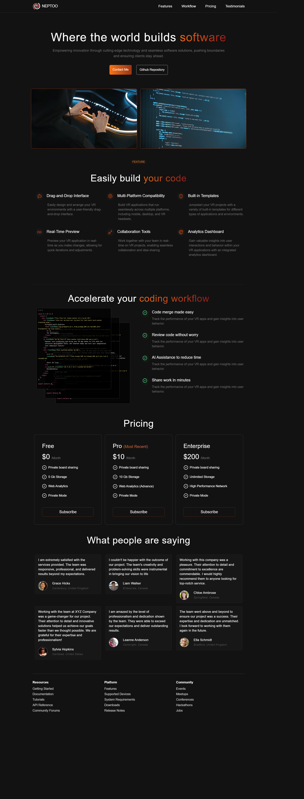

# React 和 Tailwind 构建个人网站



## 开发

[使用 Vite 安装 Tailwind CSS](https://tailwindcss.com/docs/guides/vite)

```bash
# 创建目录
npm create vite@latest . -- --template react
npm install
npm install -D tailwindcss postcss autoprefixer
npx tailwindcss init -p
```

技术栈和官方文档：

[tailwind css v3.4.4](https://tailwindcss.com/)

[Lucide 图标](https://lucide.dev/guide/installation)

```bash
npm install lucide-react
```

## 目录

```bash
│  tailwind.config.js # 将 tailwind 文档中的默认配置贴到这里
│      
└─src
    │  App.jsx
    │  index.css # 配置light/dark主题 以及 全局字体
    │  main.jsx
    │  
    ├─assets  # logo 图片和视频资源
    │      
    ├─components
    │      FeatureSection.jsx
    │      Footer.jsx
    │      HeroSection.jsx
    │      Navbar.jsx
    │      Pricing.jsx
    │      Testimonials.jsx
    │      Workflow.jsx
    │      
    └─constants
            index.jsx # 存储页面中所有的文字部分
```

> 项目文件夹下打开`cmd`  输入 `tree/f > list.txt` 即可生成目录结构

## 特性

- 点击导航栏的logo回到顶部，点击子菜单跳转到各个模块
- 引入`Lucide` 图标库，丰富的 React 图标库
- 客户评价模块，使用`random user api` 随机生成头像、名字和位置信息
- 适配宽屏和移动端

### Todo

- [ ] 按钮切换网站风格：light/dark模式
- [ ] 中文文案--个人作品集
- [ ] 完善 README
